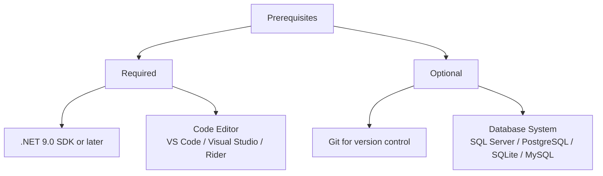
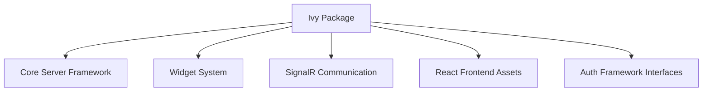
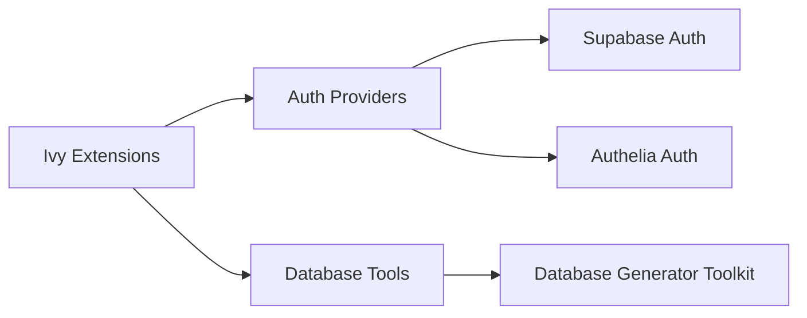
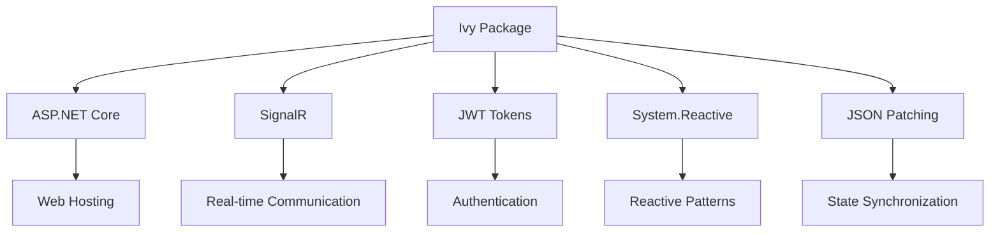
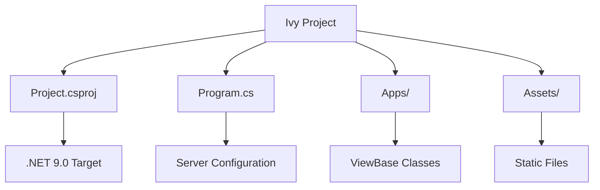
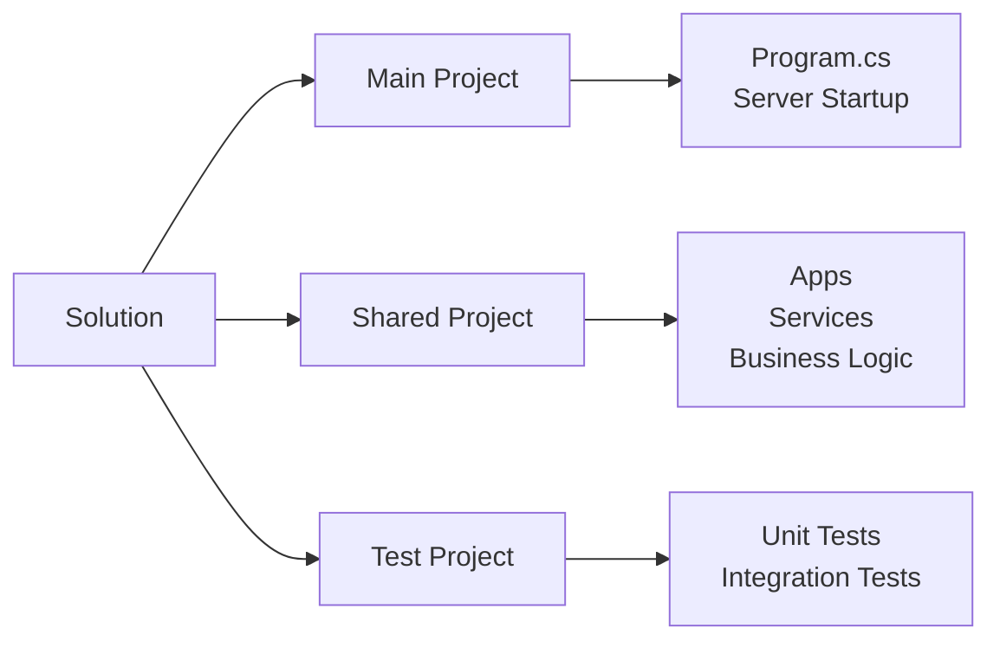
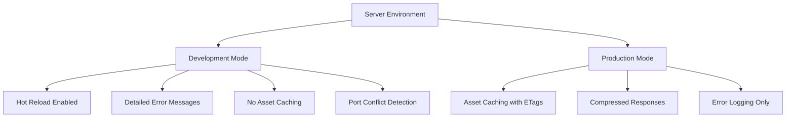

---
searchHints:
  - setup
  - install
  - cli
  - getting-started
  - download
  - prerequisites
  - packages
  - dependencies
  - project-structure
---

# Installation and Project Setup

<Ingress>
This page covers the installation of Ivy Framework components, setting up a new Ivy project, and understanding the basic project structure. It provides the foundational steps needed before building applications with Ivy.
</Ingress>

For information about core Ivy concepts like Views and state management, see [Core Concepts](../02_Concepts/Views.md). For guidance on building your first application, see [Basics](./03_Basics.md). For development tools and CLI commands, see [CLI Tools](../03_CLI/01_CLIOverview.md).

## Quick Start: Using the CLI

The easiest way to set up an Ivy project is using the Ivy CLI. This will automatically create the project structure, configuration files, and necessary setup.

### 1. Install Ivy Globally

Run the following command in your terminal to install Ivy as a global tool:

```terminal
>dotnet tool install -g Ivy.Console
```

<Callout Type="tip">
If you're using a specific operating system, read the instructions in your terminal after installing Ivy.Console.
You can always see all available commands by using `ivy --help`.
</Callout>

### 2. Create a New Ivy Project

Use the Ivy CLI to scaffold a new project:

```terminal
>ivy init --namespace Acme.InternalProject
>dotnet watch
```

This will create a new Ivy project with the necessary structure and configuration files. For more details about the generated project structure, see [Ivy Init](../03_CLI/02_Init.md).

## Prerequisites

Ivy Framework requires .NET 9.0 as the target framework. All Ivy projects and packages are built against this version.



## Manual Setup: Creating Your First Project

If you prefer to set up a project manually, follow these steps:

### Create Console Application

Create a new .NET console application:

```terminal
>dotnet new console -n MyIvyApp
>cd MyIvyApp
```

### Add Ivy Package

```terminal
>dotnet add package Ivy
```

### Basic Server Configuration

Replace the contents of `Program.cs` with minimal server setup:

```csharp
using Ivy;

var server = new Server();
server.UseHotReload();
server.AddAppsFromAssembly();
server.UseChrome();

await server.RunAsync();
```

This configuration creates a Server instance, enables hot reload for development, automatically discovers apps in the current assembly, uses default chrome (sidebar navigation), and starts the server.

### Project File Configuration

Ensure your `.csproj` targets .NET 9.0:

```xml
<Project Sdk="Microsoft.NET.Sdk">
  <PropertyGroup>
    <OutputType>Exe</OutputType>
    <TargetFramework>net9.0</TargetFramework>
    <ImplicitUsings>enable</ImplicitUsings>
    <Nullable>enable</Nullable>
  </PropertyGroup>
</Project>
```

## Core Package Installation

### Main Ivy Package

The primary Ivy Framework package is installed via NuGet:

```terminal
>dotnet add package Ivy
```



### Optional Extension Packages



**Authentication Providers:**

```terminal
>dotnet add package Ivy.Auth.Supabase    # For Supabase authentication
>dotnet add package Ivy.Auth.Authelia    # For Authelia authentication
```

**Database Tools:**

```terminal
>dotnet add package Ivy.Database.Generator.Toolkit    # Database generation utilities
```

### Package Dependencies

The main Ivy package includes several key dependencies that enable its functionality:



## Project Structure Overview

### Basic Ivy Project Layout



### Multi-Project Solution Structure

Larger projects often use a multi-project structure separating concerns:



## Server Configuration

The server configuration follows a builder pattern where each method configures different aspects of the Ivy application before calling `RunAsync()` to start the web server.

For detailed server configuration options, including `ServerArgs` properties and advanced settings, see [Program](../02_Concepts/Program.md).

### Development vs Production

The server automatically detects the environment and adjusts behavior:


