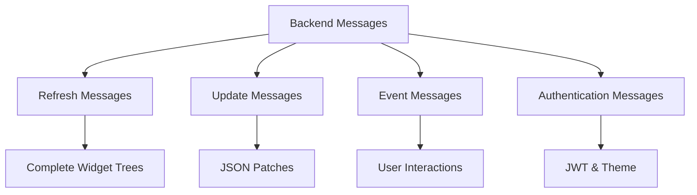
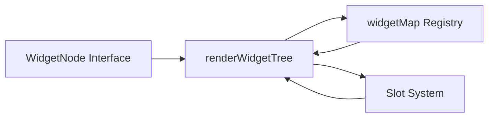
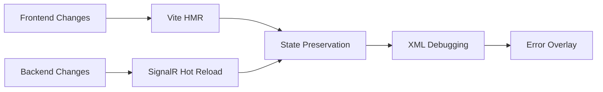

---
searchHints:
  - frontend
  - react
  - typescript
  - vite
  - widget rendering
  - signalr
---

# Frontend Architecture

<Ingress>
The Ivy frontend is a single-page React application built with TypeScript and Vite. It uses a real-time communication model where the backend sends widget tree updates that are applied to the frontend state.
</Ingress>

For information about the backend C# framework that defines widgets and handles business logic, see [Backend Architecture](./02_BackendArchitecture.md). For details on how frontend and backend communicate via SignalR, see [Communication](./03_Communication.md).

## Technology Stack

The Ivy frontend is built using modern web technologies optimized for development speed and runtime performance:

| Component | Technology | Purpose |
|-----------|------------|---------|
| UI Framework | React | UI library |
| Language | TypeScript | Type safety |
| Build Tool | Vite | Build tool and dev server |
| Styling | Tailwind CSS | Utility-first styling |
| UI Components | Radix UI | Accessible component primitives |
| Communication | SignalR | Real-time communication |

The application uses Vite as the primary build tool, providing fast hot module replacement during development and optimized production builds. React 19 with concurrent features enables responsive UI updates, while TypeScript provides compile-time type safety for the entire codebase.

For a complete list of all dependencies and their versions, see the `package.json` file in the `frontend` directory.

## Build System and Development Environment

The build system uses Vite with custom plugins for seamless integration with the C# backend. The `injectMeta` plugin fetches HTML metadata from the backend server during development, enabling the frontend to inherit page titles and configuration from the server.

**Development Workflow:**

| Service | Configuration | Purpose |
|---------|---------------|---------|
| Frontend Dev Server | Port 5173 via `npm run dev` | Development server with HMR |
| Backend Server | Port 5010 via `dotnet watch` | C# backend with hot reload |
| Metadata Injection | `injectMeta` plugin | Synchronizes page metadata from backend to frontend |
| Hot Reload | State preservation | Preserves application state during code changes |

```typescript
    plugins: [
      react(),
      injectMeta({
        host: process.env.IVY_HOST || "http://localhost:5010",
      }),
    ],
    server: {
      port: 5173,
      proxy: {
        "/ivy/messages": {
          target: process.env.IVY_HOST || "http://localhost:5010",
          ws: true,
        },
      },
    },
```

```json
  "scripts": {
    "dev": "vite",
    "build": "tsc && vite build",
    "lint": "eslint .",
    "preview": "vite preview",
    "format": "prettier --write \"src/**/*.{ts,tsx}\""
  },
```

## Real-Time Communication Architecture

The `useBackend` hook manages the SignalR connection lifecycle and processes real-time messages from the backend. The connection uses automatic reconnection and handles various message types for state synchronization.

**Message Processing:**



The hook applies JSON patches using `fast-json-patch` and `lodash.cloneDeep` to maintain immutable state updates while ensuring optimal performance.

```typescript
export function useBackend(appId: string, appArgs?: string) {
  const [widgetTree, setWidgetTree] = useState<Widget | null>(null);
  const [connectionState, setConnectionState] = useState<ConnectionState>("disconnected");
  const [hubConnection, setHubConnection] = useState<HubConnection | null>(null);
  const machineId = useMachineId();
  const { parentId } = useSearchParams();

  // ... connection setup and message handling ...
}
```

```typescript
const handleMessage = (message: BackendMessage) => {
  switch (message.type) {
    case "refresh":
      setWidgetTree(message.widget);
      break;
    case "update":
      if (widgetTree) {
        setWidgetTree(applyPatch(cloneDeep(widgetTree), message.patches).newDocument);
      }
      break;
    case "toast":
    case "error":
    case "setJwt":
    case "setTheme":
      // Handle respective message type
      break;
  }
};
```

## Widget Rendering System

The widget rendering system transforms C# widget definitions into React components through a centralized registry and rendering pipeline.

**Core Components:**



**Rendering Process:**

1. Backend sends widget definitions as `WidgetNode` structures
2. `renderWidgetTree` looks up components in `widgetMap`
3. Props are mapped and children are processed recursively
4. Slot widgets enable named content placement
5. Lazy components use `React.Suspense` with custom loading states

```typescript
export function renderWidgetTree(
  widget: Widget | null,
  onEvent: (event: WidgetEvent) => void,
  depth: number = 0
): React.ReactNode {
  if (!widget) {
    return null;
  }

  // Handle fragments - flatten them for layout optimization
  if (widget.type === "fragment") {
    const fragment = widget as FragmentWidget;
    return (
      <>
        {fragment.children?.map((child, index) =>
          renderWidgetTree(child, onEvent, depth + 1)
        )}
      </>
    );
  }

  // Look up the React component for this widget type
  const Component = widgetMap[widget.type];
  if (!Component) {
    console.warn(`Unknown widget type: ${widget.type}`);
    return null;
  }

  // Transform widget props to React component props
  const props: any = {
    ...widget.props,
    key: widget.id,
  };

  // Handle event binding - convert onClick, onChange, etc. to event handlers
  if (widget.props?.onClick) {
    props.onClick = () => {
      onEvent({
        widgetId: widget.id,
        eventType: "click",
        data: {},
      });
    };
  }

  if (widget.props?.onChange) {
    props.onChange = (value: any) => {
      onEvent({
        widgetId: widget.id,
        eventType: "change",
        data: { value },
      });
    };
  }

  // Handle slot-based content distribution
  if (widget.slots) {
    Object.keys(widget.slots).forEach((slotName) => {
      const slotContent = widget.slots![slotName];
      props[slotName] = Array.isArray(slotContent)
        ? slotContent.map((child) => renderWidgetTree(child, onEvent, depth + 1))
        : renderWidgetTree(slotContent, onEvent, depth + 1);
    });
  }

  // Handle children (non-slot content)
  if (widget.children) {
    props.children = Array.isArray(widget.children)
      ? widget.children.map((child) => renderWidgetTree(child, onEvent, depth + 1))
      : renderWidgetTree(widget.children, onEvent, depth + 1);
  }

  // Lazy load chart components
  if (widget.type.startsWith("chart")) {
    return (
      <Suspense fallback={<LoadingScreen />}>
        <Component {...props} />
      </Suspense>
    );
  }

  return <Component {...props} />;
}
```

```typescript
export interface WidgetNode {
  id: string;
  type: string;
  props?: Record<string, any>;
  children?: WidgetNode | WidgetNode[];
  slots?: Record<string, WidgetNode | WidgetNode[]>;
}
```

## Theming and Styling System

The theming system uses CSS custom properties with comprehensive light and dark mode support. The system provides a complete design token set covering colors, typography, spacing, and animations. These default styles can be overridden at runtime using the Theming service, which allows applications to dynamically generate and apply custom CSS variables through `IThemeService.SetTheme()` and `IThemeService.GenerateThemeCss()`.

**Theme Features:**

- CSS custom properties for all design tokens
- Automatic theme detection via `MutationObserver`
- Extended color palette with light/dark variants
- Typography scales with Geist font family
- Tailwind CSS integration for utility-first styling

**Font System:** The application uses Geist and Geist Mono fonts with `font-display: swap` for optimal loading performance. Font files are served locally with multiple weights (400, 500, 600, 700).

**Component Integration:** Radix UI components receive theme-aware styling through CSS custom properties, ensuring consistent appearance across light and dark modes.

```css
@import "tailwindcss";

:root {
  --background: 0 0% 100%;
  --foreground: 222.2 84% 4.9%;
  --card: 0 0% 100%;
  --card-foreground: 222.2 84% 4.9%;
  --popover: 0 0% 100%;
  --popover-foreground: 222.2 84% 4.9%;
  --primary: 222.2 47.4% 11.2%;
  --primary-foreground: 210 40% 98%;
  --secondary: 210 40% 96.1%;
  --secondary-foreground: 222.2 47.4% 11.2%;
  --muted: 210 40% 96.1%;
  --muted-foreground: 215.4 16.3% 46.9%;
  --accent: 210 40% 96.1%;
  --accent-foreground: 222.2 47.4% 11.2%;
  --destructive: 0 84.2% 60.2%;
  --destructive-foreground: 210 40% 98%;
  --border: 214.3 31.8% 91.4%;
  --input: 214.3 31.8% 91.4%;
  --ring: 222.2 84% 4.9%;
  --radius: 0.5rem;
}

.dark {
  --background: 222.2 84% 4.9%;
  --foreground: 210 40% 98%;
  --card: 222.2 84% 4.9%;
  --card-foreground: 210 40% 98%;
  --popover: 222.2 84% 4.9%;
  --popover-foreground: 210 40% 98%;
  --primary: 210 40% 98%;
  --primary-foreground: 222.2 47.4% 11.2%;
  --secondary: 217.2 32.6% 17.5%;
  --secondary-foreground: 210 40% 98%;
  --muted: 217.2 32.6% 17.5%;
  --muted-foreground: 215 20.2% 65.1%;
  --accent: 217.2 32.6% 17.5%;
  --accent-foreground: 210 40% 98%;
  --destructive: 0 62.8% 30.6%;
  --destructive-foreground: 210 40% 98%;
  --border: 217.2 32.6% 17.5%;
  --input: 217.2 32.6% 17.5%;
  --ring: 212.7 26.8% 83.9%;
}

// ... more theme definitions ...
```

```css
@font-face {
  font-family: "Geist";
  src: url("/fonts/Geist-Regular.woff2") format("woff2");
  font-weight: 400;
  font-style: normal;
  font-display: swap;
}

@font-face {
  font-family: "Geist";
  src: url("/fonts/Geist-Medium.woff2") format("woff2");
  font-weight: 500;
  font-style: normal;
  font-display: swap;
}

// ... more font definitions ...
```

```typescript
export function MermaidRenderer({ content }: { content: string }) {
  const [svg, setSvg] = useState<string | null>(null);
  const [error, setError] = useState<string | null>(null);
  const theme = useTheme();

  useEffect(() => {
    const renderDiagram = async () => {
      try {
        setError(null);
        const mermaid = (await import("mermaid")).default;
        
        mermaid.initialize({
          startOnLoad: false,
          theme: theme === "dark" ? "dark" : "default",
          securityLevel: "loose",
        });

        const id = `mermaid-${Math.random().toString(36).substr(2, 9)}`;
        const { svg: renderedSvg } = await mermaid.render(id, content);
        setSvg(renderedSvg);
      } catch (err) {
        setError(err instanceof Error ? err.message : "Failed to render diagram");
      }
    };

    renderDiagram();
  }, [content, theme]);

  if (error) {
    return <div className="text-destructive">Error: {error}</div>;
  }

  if (!svg) {
    return <LoadingScreen />;
  }

  return (
    <div
      className="mermaid-container"
      dangerouslySetInnerHTML={{ __html: svg }}
    />
  );
}
```

## Development Tools and Hot Reload

The development environment provides comprehensive hot reload capabilities for both frontend and backend changes. The system maintains application state during code updates and provides detailed debugging information.

**Development Features:**



**Development Commands:**

| Command | Purpose |
|---------|---------|
| `npm run dev` | Start development server with HMR |
| `npm run build` | Production build with optimization |
| `npm run lint` | ESLint code analysis |
| `npm run format` | Prettier code formatting |

**Backend Integration:** The development server connects to the backend via environment variable `IVY_HOST` (defaults to `http://localhost:5010`). The `injectMeta` plugin synchronizes metadata between frontend and backend during development.

```typescript
import { defineConfig } from "vite";
import react from "@vitejs/plugin-react";
import path from "path";
import { injectMeta } from "./vite-plugin-inject-meta";

export default defineConfig({
  plugins: [
    react(),
    injectMeta({
      host: process.env.IVY_HOST || "http://localhost:5010",
    }),
  ],
  resolve: {
    alias: {
      "@": path.resolve(__dirname, "./src"),
    },
  },
  server: {
    port: 5173,
    proxy: {
      "/ivy/messages": {
        target: process.env.IVY_HOST || "http://localhost:5010",
        ws: true,
      },
    },
  },
  build: {
    outDir: "dist",
    emptyOutDir: true,
    rollupOptions: {
      output: {
        entryFileNames: "assets/[name].[hash].js",
        chunkFileNames: "assets/[name].[hash].js",
        assetFileNames: "assets/[name].[hash].[ext]",
      },
    },
  },
});
```

```typescript
    connection.on("refresh", (message: RefreshMessage) => {
      handleMessage({ type: "refresh", widget: message.widget });
    });

    connection.on("update", (message: UpdateMessage) => {
      handleMessage({ type: "update", patches: message.patches });
    });
```

```typescript
    connection.start()
      .then(() => {
        setConnectionState("connected");
      })
      .catch((error) => {
        console.error("Connection error:", error);
        setConnectionState("error");
      });

    connection.onclose(() => {
      setConnectionState("disconnected");
    });

    setHubConnection(connection);

    return () => {
      connection.stop();
    };
  }, [appId, appArgs, machineId, parentId]);
```
