---
searchHints:
  - backend
  - csharp
  - asp.net
  - server
  - signalr
  - views
  - widgets
---

# Backend Architecture

<Ingress>
The Ivy backend is built on ASP.NET Core with SignalR for real-time communication. The Server class serves as the main configuration entry point, providing a fluent API for setting up applications, authentication, and services. In production, you only work with the backend C# code - the frontend is pre-built and embedded, so you don't need to manage frontend build processes or deployment.
</Ingress>

For information about the React frontend system and widget rendering, see [Frontend Architecture](./01_FrontendArchitecture.md). For details on SignalR communication patterns, see [Communication](./03_Communication.md).

## Core Server Architecture

The Ivy backend is built around the `Server` class which serves as the main configuration and hosting entry point. The server provides a fluent API for configuring applications, authentication, chrome (UI shell), and middleware.

### Server Startup Flow

The `Server` class manages three primary concerns:


```csharp
public class Server
{
    private readonly WebApplicationBuilder _builder;
    private readonly List<Type> _appTypes = new();
    private readonly List<Type> _serviceTypes = new();
    private Type? _authProviderType;
    private Chrome? _chrome;
    private bool _hotReloadEnabled;

    public Server(WebApplicationBuilder builder)
    {
        _builder = builder;
    }

    // ... configuration methods ...
}
```

### Core Server Components

The server exposes several key properties and methods for configuration:


```csharp
public async Task RunAsync()
{
    var app = _builder.Build();
    
    // Configure SignalR hub
    app.MapHub<AppHub>("/ivy/messages");
    
    // Register applications
    var appRepository = new AppRepository(_appTypes);
    app.Services.AddSingleton(appRepository);
    
    // Enable hot reload if configured
    if (_hotReloadEnabled)
    {
        var hotReloadService = app.Services.GetRequiredService<HotReloadService>();
        hotReloadService.StartWatching();
    }
    
    await app.RunAsync();
}
```

## Application System

The application system is built around a pattern where each application is defined by an `AppDescriptor` that specifies how to create `ViewBase` instances. Applications are discovered through reflection or explicitly registered.

### Application Registration and Discovery

| Registration Method | Description | Example Usage |
|-------------------|-------------|---------------|
| `AddApp(Type)` | Register a single app type | `server.AddApp<MyApp>()` |
| `AddApp(AppDescriptor)` | Register with explicit descriptor | Custom configuration |
| `AddAppsFromAssembly()` | Auto-discover apps with `[App]` attribute | Scan entire assembly |
| Constructor with `FuncBuilder` | Single-app server | Quick prototyping |

```csharp
public Server AddAppsFromAssembly(Assembly assembly)
{
    var appTypes = assembly.GetTypes()
        .Where(t => t.IsSubclassOf(typeof(ViewBase)) && t.GetCustomAttribute<AppAttribute>() != null)
        .ToList();

    _appTypes.AddRange(appTypes);
    return this;
}

public Server AddApp<T>() where T : ViewBase
{
    _appTypes.Add(typeof(T));
    return this;
}
```

### ViewBase and Application Lifecycle

Applications in Ivy inherit from `ViewBase`, which provides access to state management hooks, memoization, and service injection. The `ViewBase` class serves as the foundation for all application logic and UI composition.

**Key Features:**

- **Build()**: Method that returns widgets or other views
- **Hooks**: State management (`UseState`, `UseEffect`, etc.)
- **Services**: Dependency injection via `UseService<T>()`
- **Memoization**: Automatic caching of expensive computations
- **Lifecycle**: Automatic cleanup and resource management

```csharp
[App(icon: Icons.Calendar, name: "Todo App")]
public class TodoApp : ViewBase
{
    public override object? Build()
    {
        var todos = UseState(ImmutableArray.Create<Todo>());
        var client = UseService<IClientProvider>();
        
        return Layout.Vertical(
            new Button("Add Todo", onClick: _ => {
                todos.Set(todos.Value.Add(new Todo("New Task", false)));
                client.Toast("Todo added!");
            }),
            todos.Value.Select(todo => new TodoItem(todo))
        );
    }
}
```

## Widget System Architecture

The backend widget system defines the data models and type hierarchy for all UI components. Widgets are implemented as C# records that serialize to JSON for frontend consumption.


**Widget Type Hierarchy:** All widgets inherit from `WidgetBase` and can represent input controls, layout containers, or content renderers. The type system ensures type safety while allowing flexible composition.

**Widget Serialization:** Properties marked with `[Prop]` attribute are serialized to JSON and sent to the frontend. As an optimization, null values are not serialized - properties with null values are omitted from the JSON payload to reduce network traffic.

```csharp
public interface IAnyInput
{
    string Id { get; }
    object? Value { get; }
    bool IsReadOnly { get; }
    string? Placeholder { get; }
    ValidationState ValidationState { get; }
    string? ValidationMessage { get; }
}

public interface IInput<T> : IAnyInput
{
    new T? Value { get; }
    event Action<T?>? OnChange;
}
```

The input widget system uses a sophisticated type conversion mechanism that allows widgets to bind to various .NET types while maintaining type safety. Each input widget base class implements `SupportedStateTypes()` method that returns compatible .NET types.

## State Management

The state management system provides reactive state handling through hooks-style APIs similar to React, but implemented in C#.

State objects provide automatic change detection and can be bound directly to input widgets through extension methods like `state.ToBoolInput()` or `state.ToNumberInput()`.

```csharp
public static BoolInput ToBoolInput(this IState<bool> state, string? placeholder = null)
{
    return new BoolInput(state.Id)
        .Value(state.Value)
        .Placeholder(placeholder)
        .OnChange(value => state.Set(value));
}
```

**State Features:**

- **Automatic Change Detection**: State changes trigger re-renders
- **Type Safety**: Strongly typed state values
- **Widget Binding**: Direct conversion to input widgets
- **Persistence**: Optional state persistence across sessions
- **Computed Values**: Derived state from other state values

## Service Container and Dependency Injection

The server exposes ASP.NET Core's dependency injection container through the `Services` property, allowing registration of custom services, database contexts, and other dependencies. Here are Service Registration Patterns:

```csharp
public Server AddService<TService, TImplementation>()
    where TService : class
    where TImplementation : class, TService
{
    _serviceTypes.Add(typeof(TImplementation));
    _builder.Services.AddScoped<TService, TImplementation>();
    return this;
}

public Server AddService<TService>(Func<IServiceProvider, TService> factory)
    where TService : class
{
    _builder.Services.AddScoped(factory);
    return this;
}
```

The framework automatically registers core services like `IClientNotifier` for SignalR communication and `AppSessionStore` for session management.

**Built-in Services:**

| Service | Purpose |
|---------|---------|
| `IClientProvider` | Send messages and notifications to frontend |
| `IThemeService` | Manage application themes |
| `ILogger<T>` | Logging infrastructure |
| `AppSessionStore` | Session state management |
| `HotReloadService` | Development hot reload support |

## Real-time Communication Infrastructure

The backend provides real-time communication through SignalR with the `AppHub` class serving as the central message hub. Have a look at the SignalR Hub Architecture:

```csharp
app.MapHub<AppHub>("/ivy/messages");
app.MapHealthChecks("/ivy/health");

if (_hotReloadEnabled)
{
    var hotReloadService = app.Services.GetRequiredService<HotReloadService>();
    hotReloadService.StartWatching();
}
```

The SignalR hub is registered at the `/ivy/messages` endpoint and handles real-time communication including hot reload notifications during development and widget event processing.

Health checks are available at the `/ivy/health` endpoint, which can be used by monitoring tools and load balancers to verify application availability.

**Hub Responsibilities:**

```mermaid
graph TD
    A[AppHub] --> B[Connection Management]
    A --> C[Message Routing]
    A --> D[State Synchronization]
    A --> E[Event Handling]
    A --> F[Hot Reload]
    B --> B1[WebSocket Connections]
    C --> C1[Frontend ↔ Backend]
    D --> D1[Widget Tree State]
    E --> E1[User Interactions]
    F --> F1[Code Changes]
```



This backend architecture provides a solid foundation for building internal applications with real-time updates, type-safe widget binding, and flexible service composition while maintaining clean separation between server-side logic and frontend presentation.
