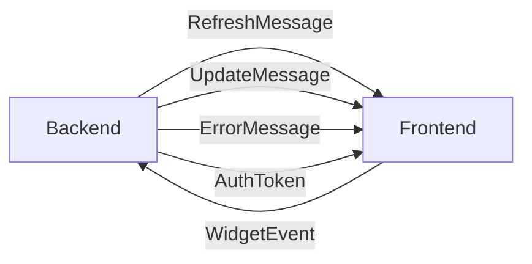
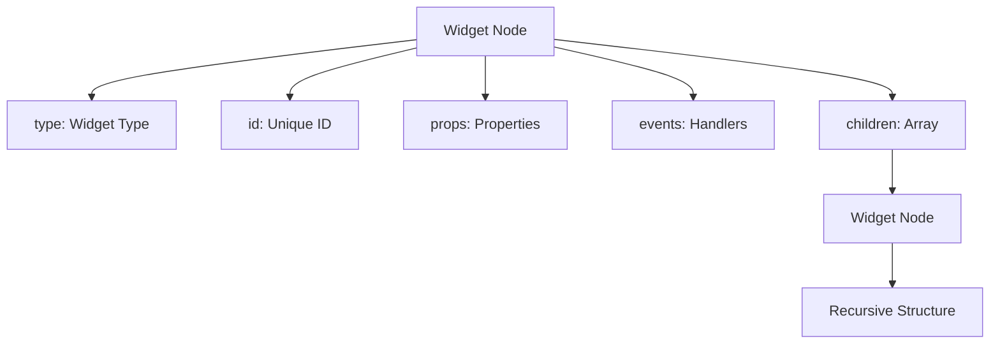
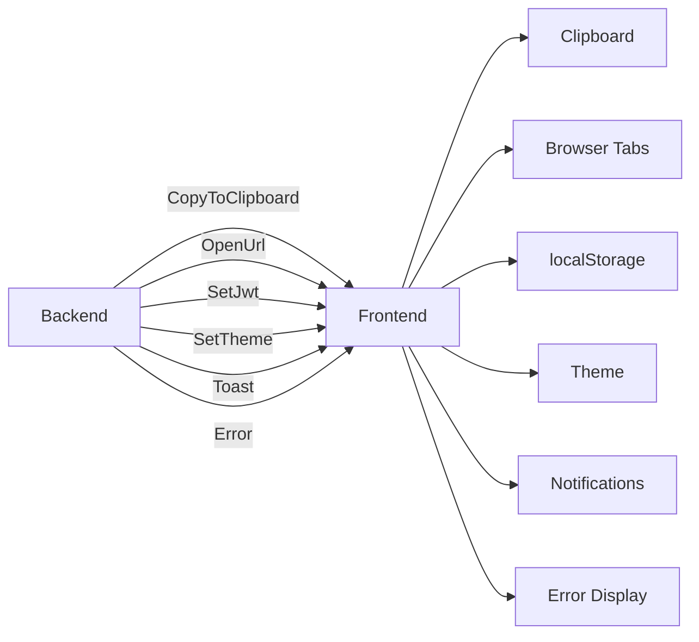

---
searchHints:
  - communication
  - signalr
  - websocket
  - protocol
  - frontend-backend
  - real-time
---

# Frontend-Backend Communication

<Ingress>
The Ivy Framework uses SignalR to establish persistent WebSocket connections between the frontend and backend, enabling real-time bidirectional communication. The frontend sends widget events to the backend, while the backend sends widget tree updates, user interface commands, and system notifications to the frontend.
</Ingress>

For information about the frontend architecture and widget rendering system, see [Frontend Architecture](./01_FrontendArchitecture.md). For details about the backend server framework and application hosting, see [Backend Architecture](./02_BackendArchitecture.md).

## Communication Architecture Overview

The Ivy Framework uses SignalR to establish persistent WebSocket connections between the frontend and backend, enabling real-time bidirectional communication. The frontend sends widget events to the backend, while the backend sends widget tree updates, user interface commands, and system notifications to the frontend.

```typescript
export function useBackend(appId: string, appArgs?: string) {
  const [widgetTree, setWidgetTree] = useState<Widget | null>(null);
  const [connectionState, setConnectionState] = useState<ConnectionState>("disconnected");
  const [hubConnection, setHubConnection] = useState<HubConnection | null>(null);
  // ... connection setup and message handling ...
}
```

```csharp
public override object? Build()
{
    var client = UseService<IClientProvider>();
    var appRepository = UseService<AppRepository>();
    
    // Build chrome UI with sidebar navigation
    return new SidebarChrome()
        .SidebarContent(/* ... */)
        .MainContent(/* ... */);
}
```

## SignalR Connection Management

The `useBackend` hook manages the SignalR connection lifecycle, including connection establishment, automatic reconnection, and cleanup. It accepts application parameters and establishes a WebSocket connection to the backend's message hub.

The connection is established with query parameters that identify the application context. The connection URL includes several parameters that provide context to the backend:

| Parameter | Description |
|-----------|-------------|
| `appId` | Identifies which application to render |
| `appArgs` | Serialized arguments passed to the application |
| `machineId` | Unique client identifier for session tracking |
| `parentId` | Parent application identifier for nested applications |

SignalR provides automatic reconnection capabilities with built-in reconnection handlers that update the UI state during connection interruptions.

```typescript
const connection = new HubConnectionBuilder()
  .withUrl(`/messages?appId=${appId}&appArgs=${encodeURIComponent(appArgs || "")}&machineId=${machineId}&parentId=${parentId || ""}`)
  .withAutomaticReconnect()
  .build();

connection.start()
  .then(() => {
    setConnectionState("connected");
  })
  .catch((error) => {
    console.error("Connection error:", error);
    setConnectionState("error");
  });

connection.onreconnecting(() => {
  setConnectionState("reconnecting");
});

connection.onreconnected(() => {
  setConnectionState("connected");
});
```

## Message Types and Communication Flow

The frontend and backend exchange several types of messages through the SignalR connection, each serving a specific purpose in maintaining the reactive user interface.



```typescript
// Backend-to-Frontend Messages
interface RefreshMessage {
  widget: WidgetNode;
}

interface UpdateMessage {
  patches: Operation[];
}

interface ErrorMessage {
  error: {
    title: string;
    description: string;
    stackTrace?: string;
  };
}

interface AuthToken {
  jwt: string | null;
}

// Frontend-to-Backend Messages
interface WidgetEvent {
  widgetId: string;
  eventType: string;
  data: Record<string, any>;
}
```

## Widget Event System

Widget events enable user interactions in the frontend to trigger backend application logic. Each widget can emit events that are handled by the backend application.

### Event Handler Implementation

The `eventHandler` function provided by `useBackend` sends widget events to the backend:

The event handler validates the connection state and logs all events for debugging purposes before sending them to the backend.

```typescript
const eventHandler = useCallback((event: WidgetEvent) => {
  if (connectionState !== "connected") {
    console.warn("Cannot send event, connection not ready:", event);
    return;
  }

  logger.debug("Sending widget event:", event);
  hubConnection?.invoke("HandleEvent", event);
}, [connectionState, hubConnection]);
```

### Backend Event Processing

The backend receives events through the SignalR hub and routes them to the appropriate application logic. Examples of event handling can be seen in the Chrome implementation:

```csharp
public async Task HandleEvent(string widgetId, string eventType, Dictionary<string, object> data)
{
    if (widgetId == "search-input" && eventType == "change")
    {
        var searchTerm = data["value"]?.ToString() ?? "";
        await UpdateSearchResults(searchTerm);
    }
    // ... handle other events
}
```

## State Synchronization and Widget Tree Updates

The Ivy Framework maintains consistency between frontend and backend state through a sophisticated widget tree synchronization system that uses JSON patches for efficient updates.

### Widget Tree Structure

The widget tree is represented as a hierarchical structure where each node contains:



### JSON Patch System

Instead of sending complete widget trees for every change, Ivy uses JSON patches to send only the differences. The `applyUpdateMessage` function efficiently applies JSON patches to the widget tree:

| Step | Description |
|------|-------------|
| Deep Cloning | Clone the current tree to avoid mutations |
| Path Traversal | Traverse to target nodes using index arrays |
| Patch Application | Apply JSON patch operations to specific locations |

```typescript
function applyUpdateMessage(tree: WidgetNode, message: UpdateMessage): WidgetNode {
  const newTree = cloneDeep(tree);
  message.patches.forEach(patch => {
    const path = patch.path.split('/').filter(Boolean);
    let current: any = newTree;
    for (let i = 0; i < path.length - 1; i++) {
      current = current[path[i]];
    }
    const lastKey = path[path.length - 1];
    switch (patch.op) {
      case 'replace': current[lastKey] = patch.value; break;
      case 'add': /* handle add */ break;
      case 'remove': /* handle remove */ break;
    }
  });
  return newTree;
}
```

### Update vs Refresh Messages

The system supports two types of widget tree synchronization:

- **Update Messages**: Contain JSON patches for incremental changes to specific parts of the tree
- **Refresh Messages**: Contain a complete new widget tree for full replacement

```typescript
connection.on("Refresh", (message: RefreshMessage) => {
  setWidgetTree(message.widget);
});

connection.on("Update", (message: UpdateMessage) => {
  if (widgetTree) {
    const updated = applyUpdateMessage(widgetTree, message);
    setWidgetTree(updated);
  }
});
```

## Client Commands and Browser Integration

The backend can send commands to control browser behavior and client-side functionality through the SignalR connection.

The backend can send various commands to the frontend:



### Client Extension Methods

The backend provides extension methods for common client operations. All methods follow the same pattern:

```csharp
public static void MethodName(this IClientProvider client, params)
{
    client.SendCommand("commandName", new { params });
}
```

| Method | Parameters | Command |
|--------|------------|---------|
| `CopyToClipboard` | `string text` | `copyToClipboard` |
| `OpenUrl` | `string url, bool newTab = true` | `openUrl` |
| `SetJwt` | `string? jwt` | `setJwt` |
| `SetTheme` | `string theme` | `setTheme` |
| `Toast` | `string message, string variant = "default"` | `toast` |

### Authentication Token Management

JWT tokens are managed through the SignalR connection, with the frontend storing tokens in localStorage and the backend coordinating authentication state:

```typescript
connection.on("setJwt", (message: { jwt: string | null }) => {
  if (message.jwt) {
    localStorage.setItem("ivy-jwt", message.jwt);
  } else {
    localStorage.removeItem("ivy-jwt");
  }
});
```

## Development and Debugging Features

The communication system includes several features to support development and debugging:

### Widget Tree XML Logging

In development mode, the frontend converts the widget tree to XML format for enhanced debugging visibility:

```typescript
function widgetTreeToXml(widget: WidgetNode): string {
  const props = Object.entries(widget.props || {})
    .map(([key, value]) => `${key}="${value}"`)
    .join(' ');
  
  const children = Array.isArray(widget.children)
    ? widget.children.map(child => widgetTreeToXml(child)).join('')
    : '';
  
  return `<${widget.type} id="${widget.id}" ${props}>${children}</${widget.type}>`;
}
```

```typescript
if (process.env.NODE_ENV === 'development') {
  console.log('Widget Tree XML:', widgetTreeToXml(widgetTree));
}
```

### Hot Reload Support

The system supports hot reload functionality for development, allowing the backend to trigger frontend updates when application code changes:

```typescript
connection.on("hotReload", () => {
  window.location.reload();
});
```

```typescript
connection.on("Refresh", (message: RefreshMessage) => {
  handleRefreshMessage(message);
  
  if (process.env.NODE_ENV === 'development') {
    logger.debug("Widget tree refreshed after hot reload");
  }
});
```

### Connection State Monitoring

The `useBackend` hook provides connection state information including disconnection status and reconnection events for debugging and user experience purposes:

```typescript
const [connectionState, setConnectionState] = useState<ConnectionState>("disconnected");
```

```typescript
connection.onclose(() => {
  setConnectionState("disconnected");
  logger.warn("Connection closed");
});

connection.onreconnecting(() => {
  setConnectionState("reconnecting");
  logger.info("Reconnecting...");
});

connection.onreconnected(() => {
  setConnectionState("connected");
  logger.info("Reconnected successfully");
});
```
