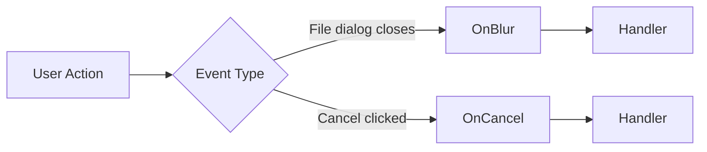

---
searchHints:
  - upload
  - file
  - attachment
  - drag-drop
  - browse
  - files
  - file-input
  - uploads
  - images
---

# FileInput

<Ingress>
Enable file uploads with automatic state management, progress tracking, type filtering, size limits, and support for single or multiple file selections.
</Ingress>

The `FileInput` widget provides a file upload interface with built-in validation, progress tracking, and drag-and-drop support. It works seamlessly with the upload system to automatically manage file data in state.

## Basic Usage

The upload system uses three key components working together:

1. **State for Files**: Holds the uploaded file(s) data in memory
2. **UseUpload Hook**: Creates an upload endpoint and returns an upload context
3. **MemoryStreamUploadHandler**: Automatically manages file data in state

To create a file input, use `ToFileInput()` with an upload context from `UseUpload()`:

```csharp demo-below
public class BasicFileInputDemo : ViewBase
{
    public override object? Build()
    {
        var fileState = UseState<FileUpload<byte[]>?>();
        var upload = this.UseUpload(MemoryStreamUploadHandler.Create(fileState));
        return fileState.ToFileInput(upload);
   }
}
```

## How It Works

The upload flow is automatic:

```csharp
// 1. Create state to hold file data
var uploadState = UseState<FileUpload<byte[]>?>();

// 2. Create upload context with handler - the handler automatically:
//    - Receives the file stream
//    - Reads it into memory
//    - Updates the state with file data
//    - Tracks upload progress
var upload = this.UseUpload(MemoryStreamUploadHandler.Create(uploadState))
    .Accept("image/*")              // Configure accepted file types
    .MaxFileSize(FileSize.FromMegabytes(5));  // Configure max file size (5 MB)

// 3. Connect to a file input - this creates a widget that:
//    - Shows a file picker
//    - Handles file selection
//    - Uploads to the server
//    - Updates the state automatically
uploadState.ToFileInput(upload).Placeholder("Choose an image");

// 4. Access uploaded file data
if (uploadState.Value != null)
{
    var fileName = uploadState.Value.FileName;
    var fileSize = uploadState.Value.Length;
    var fileData = uploadState.Value.Content; // byte[] containing file data
    var progress = uploadState.Value.Progress; // 0.0 to 1.0
}
```

Choose a handler that matches your scenario:

- `MemoryStreamUploadHandler`: Reads the entire upload into memory and updates state automatically.
- `ChunkedMemoryStreamUploadHandler`: Accumulates chunked uploads when data arrives in segments, such as audio capture.

<Callout Type="info">
In the docs we also use `SlowMemoryStreamUploadHandler` to simulate ~1 MB/s uploads for demos and progress tracking. It is documentation-only and not meant for production use.
</Callout>

### FileUpload Record

The `FileUpload<TContent>` record contains all file information:

```csharp
public record FileUpload<TContent>
{
    public Guid Id { get; init; }           // Unique identifier
    public string FileName { get; init; }   // Original file name
    public string ContentType { get; init; } // MIME type
    public long Length { get; init; }        // File size in bytes
    public float Progress { get; init; }     // Upload progress (0.0 to 1.0)
    public TContent Content { get; init; }   // File content (byte[] or string)
    public FileUploadStatus Status { get; init; } // Pending, Uploading, Completed, Failed, Aborted
}
```

## Single vs Multiple Files

The type of state determines whether single or multiple files can be selected:

```csharp demo-below
public class SingleVsMultipleDemo : ViewBase
{
    public override object? Build()
    {
        // Single file - use nullable FileUpload<byte[]>
        var singleFile = UseState<FileUpload<byte[]>?>();
        var singleUpload = this.UseUpload(
            MemoryStreamUploadHandler.Create(singleFile)
            );

        // Multiple files - use ImmutableArray<FileUpload<byte[]>>
        var multipleFiles = UseState(
            ImmutableArray.Create<FileUpload<byte[]>>()
            );
        var multipleUpload = this.UseUpload(
            MemoryStreamUploadHandler.Create(multipleFiles)
            );

        return Layout.Vertical()
                | Text.H2("Single File")
                | singleFile
                    .ToFileInput(singleUpload)
                    .Placeholder("Choose one file")
                | Text.H2("Multiple Files")
                | multipleFiles
                    .ToFileInput(multipleUpload)
                    .Placeholder("Choose multiple files");
    }
}
```

Multiple file selection is automatically enabled when you use `ImmutableArray&lt;FileUpload&lt;T&gt;&gt;` as your state type. You do **not** need to explicitly set a `.Multiple()` property.

## File Validation

Configure validation directly on the upload context using `.Accept()`, `.MaxFileSize()`, and `.MaxFiles()`:

```csharp demo-below
public class FileUploadValidation : ViewBase
{
    public override object? Build()
    {
        var selectedFiles = UseState(
            ImmutableArray.Create<FileUpload<byte[]>>()
            );
        var upload = this.UseUpload(
            MemoryStreamUploadHandler.Create(selectedFiles))
            .Accept("image/*")                    // Only images
            .MaxFileSize(FileSize.FromMegabytes(5))        // 5 MB per file
            .MaxFiles(3);                         // Maximum 3 files total

        return Layout.Vertical()
               | selectedFiles
                    .ToFileInput(upload)
                    .Placeholder("Choose up to 3 images (max 5 MB each)")
               | selectedFiles.Value.ToTable()
                   .Width(Size.Full())
                   .Builder(e => e.Length, e => e.Func((long x) => Utils.FormatBytes(x)))
                   .Builder(e => e.Progress, e => e.Func((float x) => x.ToString("P0")))
                   .Remove(e => e.Id);
    }
}
```

### File Type Filtering

Use `.Accept()` to filter file types by MIME type or file extension:

```csharp demo-below
public class FileTypeFilteringDemo : ViewBase
{
    public override object? Build()
    {
        var imageFile = UseState<FileUpload<byte[]>?>();
        var imageUpload = this.UseUpload(
            MemoryStreamUploadHandler.Create(imageFile))
            .Accept("image/*");  // Only images

        var documentFile = UseState<FileUpload<byte[]>?>();
        var documentUpload = this.UseUpload(
            MemoryStreamUploadHandler.Create(documentFile))
            .Accept(".pdf,.doc,.docx");  // Specific file extensions

        return Layout.Vertical()
                | Text.H2("Images Only")
                | imageFile
                    .ToFileInput(imageUpload)
                    .Placeholder("Choose an image")
                | Text.H2("Documents Only")
                | documentFile
                    .ToFileInput(documentUpload)
                    .Placeholder("Choose a document");
    }
}
```

### File Size Limits

Configure maximum file size with `.MaxFileSize()`:

```csharp demo-below
public class FileSizeLimitDemo : ViewBase
{
    public override object? Build()
    {
        var file = UseState<FileUpload<byte[]>?>();
        var upload = this.UseUpload(
            MemoryStreamUploadHandler.Create(file))
            .MaxFileSize(FileSize.FromMegabytes(2));

        return Layout.Vertical()
                | Text.H2("2 MB Size Limit")
                | file
                    .ToFileInput(upload)
                    .Placeholder("Max 2 MB")
                | (file.Value != null
                    ? Text.P($"Selected: {file.Value.FileName} ({Utils.FormatBytes(file.Value.Length)})")
                    : null);
    }
}
```

<Callout Tip="Info">
You can set size limits clearly with helper methods:
`.FromKilobytes()`, `.FromMegabytes()`, or `.FromGigabytes()` provide clear, self-documenting limits.
</Callout>

### Multiple Files Limit

When accepting multiple files, use `.MaxFiles()` to set a maximum count:

```csharp demo-below
public class MaxFilesDemo : ViewBase
{
    public override object? Build()
    {
        var files = UseState(
                ImmutableArray.Create<FileUpload<byte[]>>()
                );
        var upload = this.UseUpload(
            MemoryStreamUploadHandler.Create(files))
            .MaxFiles(3)  // Maximum 3 files
            .MaxFileSize(FileSize.FromMegabytes(5));

        return Layout.Vertical()
                | Text.H2("Maximum 3 Files")
                | files
                    .ToFileInput(upload)
                    .Placeholder("Choose up to 3 files")
                | Text.P($"{files.Value.Length} file(s) selected");
    }
}
```

Validation errors are automatically shown to the user via toast notifications.

## File Content Types

`MemoryStreamUploadHandler` automatically manages file uploads by reading the file stream into memory and updating your state. It handles progress tracking, cancellation, and error states automatically. The handler automatically detects the state type and configures itself accordingly.

The upload handler supports both binary and text content. Use `FileUpload<byte[]>` for binary files and `FileUpload<string>` for text files. `MemoryStreamUploadHandler.Create()` supports optional configuration parameters:

```csharp
// Binary content (default)
var binaryState = UseState<FileUpload<byte[]>?>();
var binaryUpload = this.UseUpload(MemoryStreamUploadHandler.Create(binaryState));

// Text content
// encoding: text encoding (default: UTF-8, only for FileUpload<string>)
// chunkSize: buffer size in bytes (default: 8192) 
// larger chunks = fewer progress updates but potentially better performance
// progressThreshold: minimum progress change to report (default: 0.05 = 5%)
var textState = UseState<FileUpload<string>?>();
var textUpload = this.UseUpload(
    MemoryStreamUploadHandler.Create(
        textState, 
        encoding: System.Text.Encoding.UTF8,
        chunkSize: 16384,
        progressThreshold: 0.1f
));
```

## Upload Progress

The `FileUpload` record automatically tracks upload progress:

```csharp demo-below
public class UploadProgressDemo : ViewBase
{
    public override object? Build()
    {
        var files = UseState(ImmutableArray.Create<FileUpload<byte[]>>());
        var upload = this.UseUpload(MemoryStreamUploadHandler.Create(files));

        return Layout.Vertical()
                | files
                    .ToFileInput(upload)
                    .Placeholder("Choose files")
                | files.Value.ToTable()
                    .Width(Size.Full())
                    .Builder(e => e.Length, e => e.Func((long x) => Utils.FormatBytes(x)))
                    .Builder(e => e.Progress, e => e.Func((float x) => x.ToString("P0")))
                    .Remove(e => e.Id);
    }
}
```

## Integration Examples

### Dialog Integration

Use ephemeral state for temporary file selection in dialogs:

```csharp demo-tabs
public class DialogFileUpload : ViewBase
{
    public override object? Build()
    {
        var selectedFile = UseState<FileUpload<byte[]>?>();

        // Ephemeral state used inside the dialog while picking a file
        var dialogFile = UseState<FileUpload<byte[]>?>();
        var uploadContext = this.UseUpload(
                MemoryStreamUploadHandler.Create(dialogFile))
            .Accept("*/*")
            .MaxFileSize(FileSize.FromMegabytes(10));

        var isOpen = UseState(false);

        var dialog = isOpen.Value
            ? new Dialog(
                _ => { isOpen.Value = false; dialogFile.Reset(); return ValueTask.CompletedTask; },
                new DialogHeader("Select File"),
                new DialogBody(
                    dialogFile
                        .ToFileInput(uploadContext)
                        .Placeholder("Choose a file to upload")
                ),
                new DialogFooter(
                    new Button("Cancel", 
                        _ => { isOpen.Value = false; dialogFile.Reset(); },
                        variant: ButtonVariant.Outline),
                    new Button("Ok", _ =>
                    {
                        if (dialogFile.Value != null)
                            selectedFile.Set(dialogFile.Value);
                        isOpen.Value = false;
                        dialogFile.Reset();
                    })
                )
            )
            : null;

        return Layout.Vertical()
               | new Button("Open Dialog", 
                    _ => { dialogFile.Reset(); isOpen.Value = true; })
               | (selectedFile.Value != null
                   ? selectedFile.ToDetails()
                   : Text.P("No file selected"))
               | dialog;
    }
}
```

### Form Integration

Integrate file uploads in forms using the context-aware `.Builder()` overload:

```csharp demo-tabs
public record FormFileUploadModel
{
    [Required]
    public FileUpload<byte[]>? Attachment1 { get; set; }

    public FileUpload<byte[]>? Attachment2 { get; set; }
}

public class FormFileUpload : ViewBase
{
    public override object? Build()
    {
        var model = UseState(() => new FormFileUploadModel());

        var form = model.ToForm()
            .Builder(e => e.Attachment1, (state, view) =>
            {
                var uploadContext = view.UseUpload(
                    MemoryStreamUploadHandler.Create(state))
                    .Accept("image/jpeg")
                    .MaxFileSize(FileSize.FromMegabytes(1));
                return state.ToFileInput(uploadContext);
            })
            .Label(x => x.Attachment1, "Attachment1 image/jpeg (Required)")
            .Builder(e => e.Attachment2, (state, view) =>
            {
                var uploadContext = view.UseUpload(
                    MemoryStreamUploadHandler.Create(state))
                    .Accept("application/pdf")
                    .MaxFileSize(FileSize.FromMegabytes(5));
                return state.ToFileInput(uploadContext);
            })
            .Label(x => x.Attachment2, "Attachment2 application/pdf (Optional)");

        return Layout.Vertical()
               | form
               | model.Value.Attachment1?.ToDetails()
               | model.Value.Attachment2?.ToDetails();
    }
}
```

## Disabled State

Disable the file input:

```csharp demo-below
public class FileInputDisabledDemo : ViewBase
{
    public override object? Build()
    {
        var fileState = UseState<FileUpload<byte[]>?>();
        var upload = this.UseUpload(
            MemoryStreamUploadHandler.Create(fileState)
            );

        return fileState.ToFileInput(upload)
                    .Placeholder("This file input is disabled")
                    .Accept(".jpg,.png")
                    .Disabled();
    }
}
```

## Event Handlers

FileInput supports event handlers to respond to user interactions:



```csharp demo-below
public class FileInputEventHandlersDemo : ViewBase
{
    public override object? Build()
    {
        var files = UseState(ImmutableArray.Create<FileUpload<byte[]>>());
        var blurMessage = UseState("");
        var cancelCount = UseState(0);
        var upload = this.UseUpload(MemoryStreamUploadHandler.Create(files));

        return Layout.Vertical()
                | files.ToFileInput(upload)
                    .Placeholder("Choose files")
                    .HandleBlur((Event<IAnyInput> e) =>
                    {
                        if (files.Value.Length > 0)
                            blurMessage.Set($"Blur: {files.Value.Length} file(s) selected");
                        else
                            blurMessage.Set("Blur: No file selected");
                    })
                    .HandleCancel((Guid fileId) =>
                    {
                        upload.Value.Cancel(fileId);
                        files.Set(list => list.Where(f => f.Id != fileId).ToImmutableArray());
                        cancelCount.Set(cancelCount.Value + 1);
                    })
                | (blurMessage.Value != "" 
                    ? Text.P(blurMessage.Value).Color(Colors.Success)
                    : null)
                | files.Value.ToTable()
                    .Width(Size.Full())
                    .Builder(e => e.FileName, e => e.Func((string x) => x))
                    .Builder(e => e.Progress, e => e.Func((float x) => x.ToString("P0")))
                    .Remove(e => e.Id)
                | (cancelCount.Value > 0
                    ? Text.P($"Cancelled {cancelCount.Value} file(s)").Color(Colors.Info)
                    : null);
    }
}
```

## Best Practices

1. **Choose the Right Content Type**: Use `byte[]` for binary files, `string` for text files
2. **Set Validation Rules**: Always configure `Accept()` and `MaxFileSize()` to guide users
3. **Limit Multiple Uploads**: Use `MaxFiles()` when accepting multiple files
4. **Progress Feedback**: The `Progress` property automatically updates during upload
5. **State Reset**: Use `state.Reset()` to clear uploaded files
6. **Form Integration**: Use the context-aware `.Builder()` overload for proper hook access

<WidgetDocs Type="Ivy.FileInput" ExtensionTypes="Ivy.FileInputExtensions" SourceUrl="https://github.com/Ivy-Interactive/Ivy-Framework/blob/main/Ivy/Widgets/Inputs/FileInput.cs"/>
