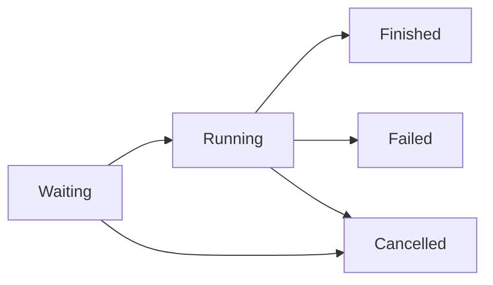

---
searchHints:
  - job scheduler
  - background tasks
  - async workflows
  - dependency graph
  - progress tracking
---

# JobScheduler

<!-- markdownlint-disable-next-line MD033 -->
<Ingress>
Coordinate complex async work with declarative job graphs, dependency-aware scheduling, and built-in UI status reporting.
</Ingress>

The `JobScheduler` in `Ivy.Helpers` orchestrates asynchronous jobs, resolves dependencies, and exposes real-time state via reactive updates. Pair it with `JobSchedulerExtensions.ToView()` to render a hierarchical job monitor.

## Basic Usage

Create a scheduler, define jobs, and use a button to trigger execution:

```csharp demo-tabs
public class JobsDashboard : ViewBase
{
    public override object? Build()
    {
        var scheduler = this.UseStatic(BuildScheduler);
        var refresh = this.UseRefreshToken();

        UseEffect(() => scheduler.Subscribe(_ => refresh.Refresh()));

        return Layout.Vertical()
            | new Button("Start Jobs", onClick: async _ => await scheduler.RunAsync())
            | scheduler.ToView();
    }

    private static JobScheduler BuildScheduler()
    {
        var scheduler = new JobScheduler(maxParallelJobs: 2);

        var initialize = scheduler.CreateJob("Initialize")
            .WithAction(async (_, _, progress, token) =>
            {
                await Task.Delay(300, token);
                progress.Report(1);
            })
            .Build();

        scheduler.CreateJob("Load Data")
            .DependsOn(initialize)
            .WithAction(async (_, _, progress, token) =>
            {
                await Task.Delay(500, token);
                progress.Report(1);
            })
            .Build();

        scheduler.CreateJob("Refresh Cache")
            .WithAction(async (_, _, progress, token) =>
            {
                for (var i = 0; i < 5; i++)
                {
                    await Task.Delay(100, token);
                    progress.Report((i + 1) / 5.0);
                }
            })
            .Build();

        return scheduler;
    }
}
```

<Callout Type="tip">
Call `progress.Report(0..1)` inside the action to report progress. The scheduler clamps values and the built-in view renders a progress bar automatically.
</Callout>

## Job States

Jobs transition through these states automatically:



### Linear Dependencies

`DependsOn` enforces that a job waits for its prerequisites to finish before entering the queue.

```csharp demo-tabs
public class DependencyGraphDemo : ViewBase
{
    public override object? Build()
    {
        var scheduler = this.UseStatic(BuildScheduler);
        var refresh = this.UseRefreshToken();

        UseEffect(() => scheduler.Subscribe(_ => refresh.Refresh()));

        return Layout.Vertical()
            | new Button("Run Pipeline", onClick: async _ => await scheduler.RunAsync())
            | scheduler.ToView();
    }

    private static JobScheduler BuildScheduler()
    {
        var scheduler = new JobScheduler(maxParallelJobs: 1);

        var extract = scheduler.CreateJob("Extract Data")
            .WithAction(async (_, _, progress, token) =>
            {
                await Task.Delay(300, token);
                progress.Report(1);
            })
            .Build();

        var transform = scheduler.CreateJob("Transform Data")
            .DependsOn(extract)
            .WithAction(async (_, _, progress, token) =>
            {
                await Task.Delay(300, token);
                progress.Report(1);
            })
            .Build();

        scheduler.CreateJob("Load Data")
            .DependsOn(extract, transform)
            .WithAction(async (_, _, progress, token) =>
            {
                await Task.Delay(300, token);
                progress.Report(1);
            })
            .Build();

        return scheduler;
    }
}
```

`WithAction` overloads accept signatures ranging from `Func<Task>` to full access with `(Job, IJobScheduler, IProgress<double>, CancellationToken)`.

### Dynamically Adding Child Jobs

Children can be attached to a parent at build time or while the parent is running. When added during execution, the scheduler defers them until the parent finishes its action.

```csharp demo-tabs
public class DynamicChildrenDemo : ViewBase
{
    public override object? Build()
    {
        var scheduler = this.UseStatic(BuildScheduler);
        var refresh = this.UseRefreshToken();

        UseEffect(() => scheduler.Subscribe(_ => refresh.Refresh()));

        return Layout.Vertical()
            | new Button("Generate Reports", onClick: async _ => await scheduler.RunAsync())
            | scheduler.ToView();
    }

    private static JobScheduler BuildScheduler()
    {
        var scheduler = new JobScheduler(maxParallelJobs: 2);

        scheduler.CreateJob("Generate Reports")
            .WithAction(async (job, sched, _, token) =>
            {
                for (int i = 1; i <= 3; i++)
                {
                    var child = sched.CreateJob($"Report {i}")
                        .WithAction(async (_, _, progress, childToken) =>
                        {
                            await Task.Delay(200, childToken);
                            progress.Report(1);
                        })
                        .Build();

                    sched.AddChild(job, child);
                }

                await Task.Delay(600, token);
            })
            .Build();

        return scheduler;
    }
}
```

### Fluent Job Chaining

Use `Then()` to chain dependent jobs fluently:

```csharp demo-tabs
public class FluentChainingDemo : ViewBase
{
    public override object? Build()
    {
        var scheduler = this.UseStatic(BuildScheduler);
        var refresh = this.UseRefreshToken();

        UseEffect(() => scheduler.Subscribe(_ => refresh.Refresh()));

        return Layout.Vertical()
            | new Button("Run Pipeline", onClick: async _ => await scheduler.RunAsync())
            | scheduler.ToView();
    }

    private static JobScheduler BuildScheduler()
    {
        var scheduler = new JobScheduler(maxParallelJobs: 1);

        scheduler.CreateJob("Step 1: Extract")
            .WithAction(async (_, _, progress, token) =>
            {
                await Task.Delay(300, token);
                progress.Report(1);
            })
            .Then("Step 2: Transform", async (_, _, progress, token) =>
            {
                await Task.Delay(300, token);
                progress.Report(1);
            })
            .Then("Step 3: Load", async (_, _, progress, token) =>
            {
                await Task.Delay(300, token);
                progress.Report(1);
            })
            .Build();

        return scheduler;
    }
}
```

### Multiple Children with Progress

Create complex job hierarchies with multiple children that report progress:

```csharp demo-tabs
public class MultipleChildrenDemo : ViewBase
{
    public override object? Build()
    {
        var scheduler = this.UseStatic(BuildScheduler);
        var refresh = this.UseRefreshToken();

        UseEffect(() => scheduler.Subscribe(_ => refresh.Refresh()));

        return Layout.Vertical()
            | new Button("Start Processing", onClick: async _ => await scheduler.RunAsync())
            | scheduler.ToView();
    }

    private static JobScheduler BuildScheduler()
    {
        var scheduler = new JobScheduler(maxParallelJobs: 3);

        Job jobA = scheduler.CreateJob("Job A")
            .WithAction(async (job, sched, _, token) =>
            {
                // Create multiple children with progress reporting
                for (int i = 1; i <= 5; i++)
                {
                    var child = sched.CreateJob($"Child A-{i}")
                        .WithAction(async (_, _, progress, childToken) =>
                        {
                            for (int j = 0; j <= 100; j++)
                            {
                                await Task.Delay(30, childToken);
                                progress.Report(j / 100.0);
                            }
                        })
                        .Build();

                    sched.AddChild(job, child);
                }

                await Task.Delay(500, token);
            })
            .Build();

        // Job B depends on Job A
        scheduler.CreateJob("Job B")
            .DependsOn(jobA)
            .WithAction(async (_, _, progress, token) =>
            {
                await Task.Delay(400, token);
                progress.Report(1);
            })
            .Build();

        // Job C is independent
        scheduler.CreateJob("Job C")
            .WithAction(async (_, _, progress, token) =>
            {
                await Task.Delay(600, token);
                progress.Report(1);
            })
            .Build();

        return scheduler;
    }
}
```

## Reference

| Method | Description |
|--------|-------------|
| `JobScheduler(int maxParallelJobs)` | Constructor that controls concurrency and lifecycle. |
| `JobScheduler.CreateJob(string title)` | Creates a new job builder. Returns `JobBuilder`. |
| `JobBuilder.WithTitle(string title)` | Sets or updates the job title. |
| `JobBuilder.WithAction(...)` | Registers job logic. Supports multiple overloads. |
| `JobBuilder.DependsOn(params Job[] jobs)` | Sets job prerequisites. |
| `JobBuilder.WithContinueOnChildFailure(bool)` | Keeps parents alive when children fail. |
| `JobBuilder.Then(...)` | Chains dependent jobs fluently. |
| `JobBuilder.Build()` | Builds and registers the job with the scheduler. |
| `Job.SetDisplay(object? display)` | Attaches custom status UI to the job. |
| `JobScheduler.AddChild(Job parent, Job child)` | Links dynamic child work to a parent job. |
| `JobSchedulerExtensions.ToView()` | Renders the scheduler state using Ivy components. |
| `JobScheduler.RunAsync(CancellationToken?)` | Starts scheduling and waits until all jobs settle. |
| `JobScheduler.CancelAll()` | Requests cancellation on all running jobs. |
| `JobScheduler.AllCompleted()` | Returns `true` when every job is `Finished`. |
| `JobScheduler.Subscribe(IObserver<Job> observer)` | Yields each job update for state refresh or logging. |
